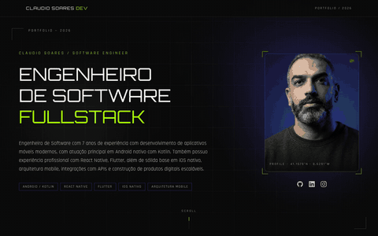
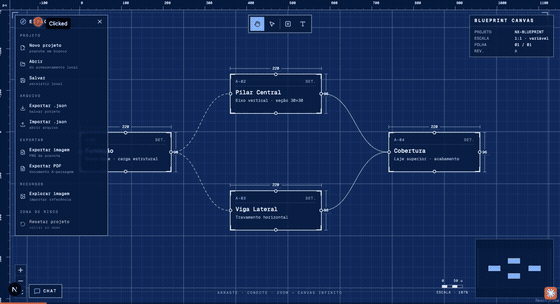
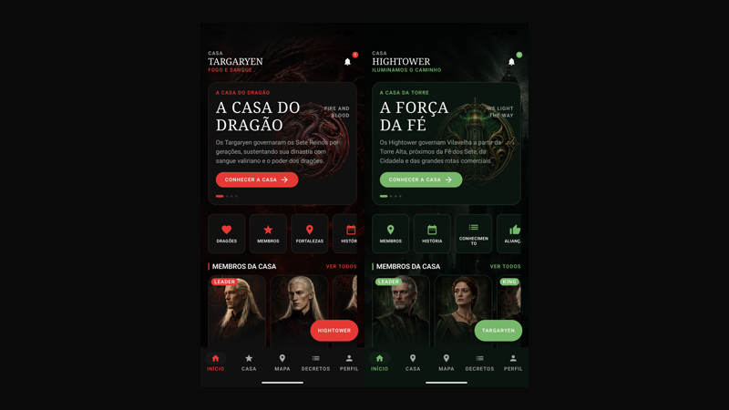
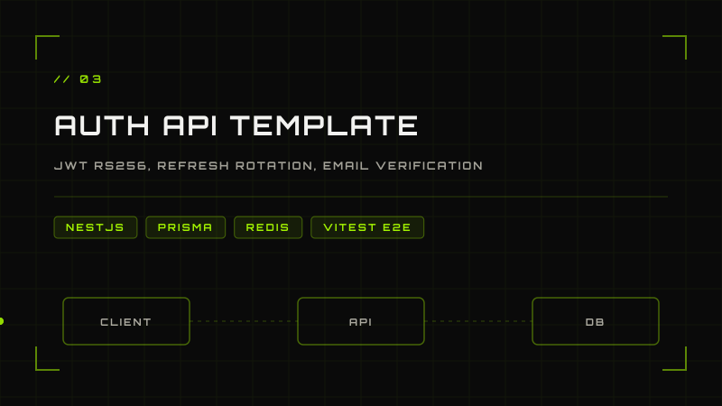
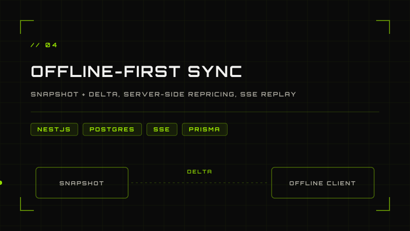

<picture>
  <source media="(prefers-color-scheme: dark)" srcset="docs/header-dark.svg">
  <source media="(prefers-color-scheme: light)" srcset="docs/header-light.svg">
  
</picture>

🇧🇷 [Português](README.md) · 🇺🇸 English · 🇪🇸 [Español](README.es.md)

Software developer with **6 years** of experience building **mobile applications** and **back-end systems**.

**Native** development on **Android** (Kotlin/Java) and **iOS**, plus cross-platform with
**React Native**, **Flutter** and **Kotlin Multiplatform**.
On the back end, **Node.js**, **TypeScript**, **NestJS** and REST APIs.

Feel free to check out my repositories and projects — I'm always open to new ideas
and collaborations!

## Featured projects

<table>
<tr>
<td width="50%" valign="top">

**[Portfolio](https://github.com/claudiosoaresdev/portfolio)** — HUD-futuristic aesthetic with a
scroll-driven 3D smartphone showcase.

`Next.js` `TypeScript` `Three.js` `GitHub Pages`

[Live demo](https://claudiosoaresdev.github.io/portfolio/) · [Source](https://github.com/claudiosoaresdev/portfolio)

</td>
<td width="50%" valign="top">

**[Nx Blueprint](https://github.com/claudiosoaresdev/blueprint-canvas-demo)** — the architecture
blueprint for a Next.js app: multi-tenant, i18n, server-first auth and modern caching.

`Next.js` `TypeScript` `shadcn/ui`

[Source](https://github.com/claudiosoaresdev/blueprint-canvas-demo)

</td>
</tr>
<tr>
<td width="50%" valign="top">

**[Realm Compose UI](https://github.com/claudiosoaresdev/realm-compose-ui)** — Server Driven UI on
Android: the same screen becomes two different houses from the payload alone, no release needed.

`Kotlin` `Jetpack Compose` `Koin` `Retrofit`

[Source](https://github.com/claudiosoaresdev/realm-compose-ui)

</td>
<td width="50%" valign="top">

<a href="https://github.com/claudiosoaresdev/nestjs-auth-template"><picture>
  <source media="(prefers-color-scheme: dark)" srcset="docs/card-auth-dark.svg">
  <source media="(prefers-color-scheme: light)" srcset="docs/card-auth-light.svg">
  
</picture></a>

**[NestJS Auth Template](https://github.com/claudiosoaresdev/nestjs-auth-template)** — JWT RS256,
refresh token rotation, email verification and password reset. Clean architecture and e2e tests.

`NestJS` `Prisma` `Redis` `Vitest`

[Source](https://github.com/claudiosoaresdev/nestjs-auth-template)

</td>
</tr>
</table>

<b>One more project</b>

 

<a href="https://github.com/claudiosoaresdev/nest-offline-sync"><picture>
  <source media="(prefers-color-scheme: dark)" srcset="docs/card-sync-dark.svg">
  <source media="(prefers-color-scheme: light)" srcset="docs/card-sync-light.svg">
  
</picture></a>

**[nest-offline-sync](https://github.com/claudiosoaresdev/nest-offline-sync)** — offline-first sync
for a large catalog (~3000 products): snapshot + delta sync, server-side repricing and real-time
events over SSE with automatic replay.

`NestJS` `PostgreSQL` `Prisma` `SSE`

## Contact

