<picture>
  <source media="(prefers-color-scheme: dark)" srcset="docs/header-dark.svg">
  <source media="(prefers-color-scheme: light)" srcset="docs/header-light.svg">
  
</picture>

🇧🇷 [Português](README.md) · 🇺🇸 [English](README.en.md) · 🇪🇸 Español

Desarrollador de software con **6 años** de experiencia construyendo **aplicaciones móviles**
y **sistemas back-end**.

Desarrollo **nativo** en **Android** (Kotlin/Java) e **iOS**, y también multiplataforma con
**React Native**, **Flutter** y **Kotlin Multiplatform**.
En el back-end, **Node.js**, **TypeScript**, **NestJS** y APIs REST.

¡Siéntete libre de explorar mis repositorios y proyectos! Me gusta intercambiar ideas
y colaborar en nuevos desafíos.

## Contacto

